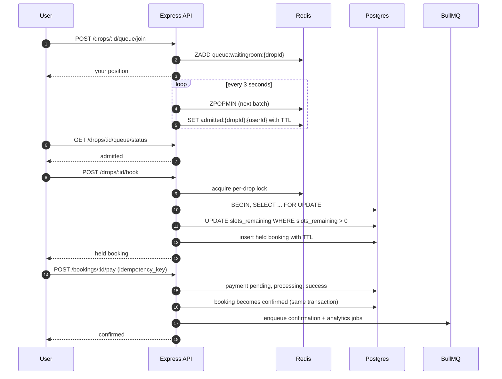
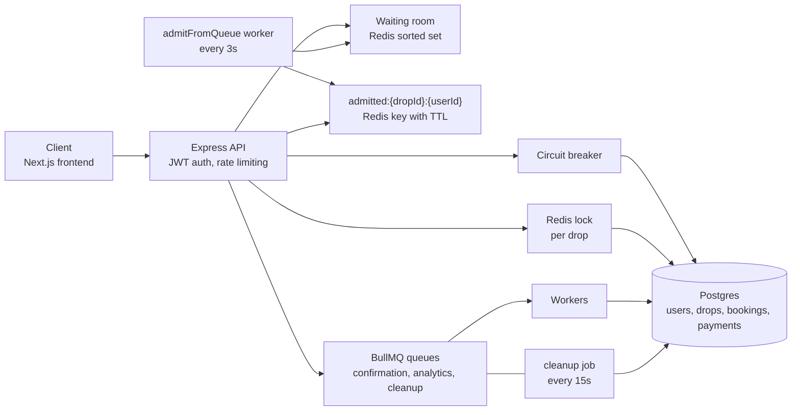
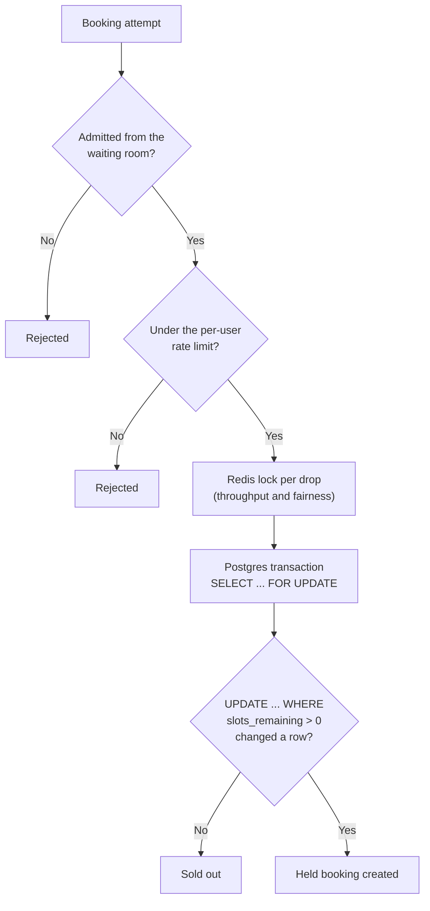
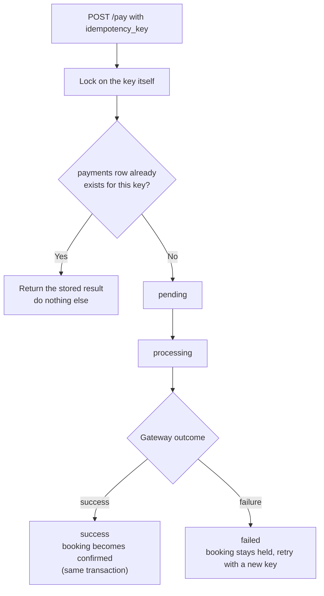
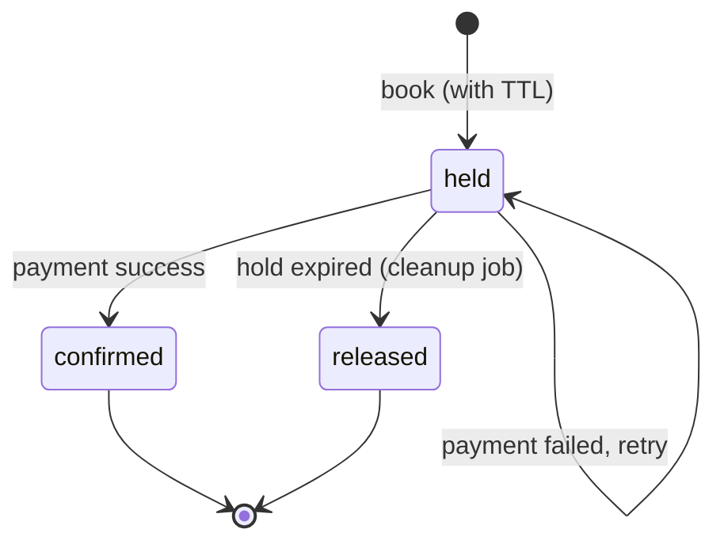

# 🔒 QueueLock: Backend

**A high-concurrency booking system that never oversells.**
Thousands of people hit "book" for a handful of slots at the same moment. QueueLock lets them in fairly, one batch at a time, and makes sure every slot is sold exactly once.


Built by **[Shivansh Kumar](https://shivanshonline.in)** · [GitHub](https://github.com/shivansh07adi-cloud)

> A learning project about the hard parts of flash-sale systems: races, fairness, retries and load.
>
> This repo is the **backend API only**. The Next.js UI lives in its own repo: [queuelock-frontend](https://github.com/shivansh07adi-cloud/queuelock-frontend).

---

## The problem

When a limited drop opens (concert tickets, sneakers, appointment slots), many users act in the same millisecond. A naive system has three classic failures:

| Failure | What goes wrong | How QueueLock handles it |
|---|---|---|
| **Overselling** | Two users both get the last slot | Postgres row lock + guarded update, with a Redis lock in front |
| **Unfair access** | Whoever hammers the server wins | Strict FIFO waiting room; you can't book without being admitted |
| **Double charging** | A retry or double-click pays twice | Idempotency key: one key, one charge, always |

---

## How a booking works



---

## Architecture



---

## Three layers that stop overselling



The Redis lock is **not** what makes the system correct. Postgres is. Even with the Redis lock removed, `UPDATE ... WHERE slots_remaining > 0` inside a `SELECT ... FOR UPDATE` transaction prevents overselling by itself. The Redis lock stops a stampede from all hitting the same database row at once, which helps throughput and fairness.

A **circuit breaker** wraps the booking database path. If it fails repeatedly, requests fail fast for a few seconds instead of piling up on a struggling database.

---

## The waiting room

- `POST /api/drops/:id/queue/join` adds you to a Redis sorted set and returns your position.
- A background worker (`src/workers/admitFromQueue.js`) admits the next batch every 3 seconds with `ZPOPMIN`. That makes it **strict FIFO**: the earliest joiner is always first, even when many join in the same millisecond.
- Admission sets `admitted:{dropId}:{userId}` in Redis with a TTL. Booking requires this key, so nobody can skip the line.
- `GET /api/drops/:id/queue/status` shows your position or whether you have been admitted.
- Queue-join and booking are **rate limited per user**, so one user spamming a route can't hurt anyone else.

---

## Idempotent payments

`POST /api/bookings/:id/pay` takes a client-generated `idempotency_key` and a mock `simulate` outcome (`success`, `failure` or `timeout`; default `success`). This stands in for a real gateway such as Stripe or Razorpay.

**The guarantee:** calling it many times with the same key, whether from a network retry or a mashed pay button, charges and confirms **once**. Every repeat replays the first call's stored result.



Postgres also enforces `UNIQUE` on `idempotency_key` as a second line of defense. If the booking is already confirmed, a second payment with a *different* key is rejected instead of charging twice.

### Booking lifecycle



---

## Background jobs

BullMQ runs three queues, each with its own worker (`src/queues/workers.js`):

| Queue | Job |
|---|---|
| `confirmation` | Sent after a successful payment, never delays the HTTP response |
| `analytics` | Recorded after a successful payment |
| `cleanup` | Repeatable job every 15 seconds that releases stale holds back to the pool, with retries |

> BullMQ needs a **real Redis server**. It uses Lua scripts, so `ioredis-mock` will not work.

---

## Quick start

You need Node.js, a Postgres database (Supabase's free tier works) and a real Redis server.

```bash
git clone https://github.com/shivansh07adi-cloud/queuelock-backend.git
cd queuelock-backend
npm install
cp .env.example .env        # Windows: copy .env.example .env
```

Edit `.env`:

| Variable | Meaning |
|---|---|
| `DATABASE_URL` | Postgres connection string |
| `JWT_SECRET` | Any long random string |
| `PG_POOL_MAX` | Optional. Postgres pool size (default 20) |

Then:

```bash
npm run migrate      # create the tables
npm run dev          # start the API
curl localhost:4000/health
```

**Making yourself an admin.** The first user you register is a normal user. Promote yourself in the database while testing:

```sql
UPDATE users SET role = 'admin' WHERE email = 'you@example.com';
```

---

## API

| Method | Route | Auth | Description |
|---|---|---|---|
| POST | `/api/auth/register` | none | Create an account |
| POST | `/api/auth/login` | none | Get a JWT |
| GET | `/api/drops` | none | List all drops |
| GET | `/api/drops/:id` | none | Get one drop |
| POST | `/api/drops` | admin | Create a drop |
| PATCH | `/api/drops/:id/status` | admin | `draft` → `live` → `closed` |
| POST | `/api/drops/:id/queue/join` | user | Join the waiting room for a live drop |
| GET | `/api/drops/:id/queue/status` | user | Your position or admission status |
| POST | `/api/drops/:id/book` | user (admitted) | Attempt to book one slot |
| POST | `/api/bookings/:id/pay` | booking owner | Pay for a held booking (idempotent) |
| GET | `/api/bookings/:id` | owner or admin | Get one booking's status |

---

## Proving it works

Start the server with `npm run dev` in one terminal, then run these in another.

| Command | What it proves |
|---|---|
| `npm run test:concurrency` | 40 users fight for **5 slots** through the waiting room. Exactly 5 succeed, 35 get a clean "sold out", and `slots_remaining` ends at exactly 0. Takes about 25 to 40 seconds because it waits on real admission cycles |
| `npm run test:fairness` | 12 users join in order, and nobody who joined later is admitted before someone who joined earlier |
| `npm run test:idempotency` | 8 concurrent payments with the **same key** create exactly one payment record and confirm the booking once. A second, different key on the confirmed booking is rejected |

### Load test (k6)

The correctness tests above check logic. The load test measures real latency and throughput, so it must run against your real Postgres and Redis.

```bash
node load-tests/setup-drop.js     # creates the drop and prints the exact k6 command
k6 run load-tests/k6-flash-sale.js
```

It simulates a flash-sale stampede: **200 virtual users, 500 booking attempts** against a small-slot drop. Full instructions and the results to expect are in `load-tests/README.md`.

**A real hardening fix from this phase:** the Postgres pool now sets `max: 20` explicitly (the node-postgres default is 10), because 200 concurrent users would otherwise mostly queue for a free connection. Change it with `PG_POOL_MAX`.

---

## Frontend

The UI is a separate Next.js app in its own repo, [queuelock-frontend](https://github.com/shivansh07adi-cloud/queuelock-frontend), with its own README and setup. Run this backend first (default `http://localhost:4000`), then point the frontend at it. The UI includes custom animated components: flap counter, splash cursor, flowing menu, curved loop, dome gallery and pixel transition.

## Project structure

```
src/
├── config/db.js               Postgres pool
├── middleware/rateLimit.js    per-user rate limiting
├── utils/
│   ├── lock.js                Redis distributed lock
│   └── circuitBreaker.js      fail-fast wrapper for the booking DB path
├── workers/admitFromQueue.js  admits the next batch every 3s
├── queues/                    BullMQ queues and workers.js
scripts/                       concurrency, fairness and idempotency tests
load-tests/                    k6 flash-sale script and setup
```

## Build phases

| Phase | What was built |
|---|---|
| 1. Foundations | Express skeleton, JWT auth, Postgres schema, drop CRUD |
| 2. Concurrency engine | Redis lock, held bookings with TTL, overselling tests |
| 3. Waiting room | FIFO queue, admission windows, rate limiting, circuit breaker |
| 4. Payments | Idempotent payment state machine |
| 5. Jobs and frontend | BullMQ queues here; the Next.js UI is in the frontend repo |
| 6. Load testing | k6 stampede test, connection pool fix |
| 7. Deployment | Not built yet |

---

© 2026 [Shivansh Kumar](https://shivanshonline.in)
